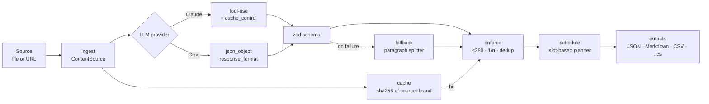

<div align="center">

# 🪶 OmniPost

**Agentic TypeScript pipeline that turns one long-form source into platform-native posts for X, LinkedIn, Instagram and newsletter — plus a weekly content calendar (CSV + `.ics`). LLM drafts; code enforces every character limit, hashtag rule and thread split.**

[](https://www.typescriptlang.org/)
[](https://nodejs.org/)
[](https://www.anthropic.com/)
[](https://groq.com/)
[](#license)

[Live demo](https://morgunglyeb-arch.github.io/omnipost/) · [Case study](./PORTFOLIO.md) · [Architecture](#architecture) · [Testing](./TESTING.md)

</div>

---

## What it does

Give OmniPost one long-form source — a blog post, a podcast transcript, a brain-dump in Markdown, or a URL — and it produces a full content bundle:

- **3 opening hooks** to A/B in any channel
- **An X / Twitter thread**, every tweet ≤ 280 chars, auto-numbered `1/n`
- **A LinkedIn post** with paragraph structure preserved
- **An Instagram caption** with a deduplicated hashtag set (≤ 10)
- **3–5 pull quotes** for graphics or repurposing
- **A newsletter blurb** with the brand CTA baked in
- **A weekly content calendar** as `calendar.csv` and `calendar.ics` (drag into Google Calendar)

All four destinations are first-class. Brand voice — tone, audience, CTA, do/don't list, language — comes from `.env` and is part of the cache key.

## The point

Two design choices make this reliable in production:

1. **LLM drafts, code enforces.** Language models cannot count characters or dedup hashtags reliably. So everything that has to be exact — the 280-char tweet limit, `1/n` thread numbering, hashtag normalization, platform-specific markdown stripping — lives in pure code (`enforce.ts`). The LLM is only asked to write good prose.
2. **One zod schema, two providers, one fallback.** Claude path uses tool-use; Groq path uses `response_format: json_object`. Both branches deserialize into the same zod schema. If either fails or returns invalid JSON, a deterministic paragraph-splitter produces a usable draft and the run is marked `degraded: true`. The pipeline never silently breaks.

## Architecture



## Stack

- **Language:** TypeScript 5.6, ESM, strict mode, `noUncheckedIndexedAccess`
- **Runtime:** Node.js 20+, `tsx` for dev
- **LLM:** [`@anthropic-ai/sdk`](https://github.com/anthropics/anthropic-sdk-typescript) (tool-use + prompt caching) and [`openai`](https://github.com/openai/openai-node) SDK pointed at Groq's OpenAI-compatible endpoint
- **Validation:** [`zod`](https://zod.dev/) — typed runtime guard on every LLM response
- **Sources:** file (`.md`/`.txt`) and URL (native `fetch` + small main-text extractor)
- **Calendar:** RFC-5545 `.ics` generation, zero dependencies
- **Tooling:** no bundler — direct `tsx` execution, `tsc --noEmit` for typecheck

## Quick start

```bash
git clone https://github.com/morgunglyeb-arch/omnipost
cd omnipost
npm install
cp .env.example .env             # fill keys (or skip and use --mock)
npm run gen:demo                 # seeds the cache + docs/sample.json
npm run repurpose -- --mock --dry          # offline preview, no API key
npm run repurpose -- --schedule --days=7   # write posts + calendar
npm test                                    # 29-assertion offline smoke test
```

## CLI

```bash
npm run repurpose -- --input=data/source.md --dry       # print, do not write
npm run repurpose -- --mock --dry                        # offline demo
npm run repurpose -- --url=https://example.com/article   # repurpose a URL
npm run repurpose -- --platforms=x,linkedin              # subset of channels
npm run repurpose -- --schedule --days=7                 # add a content calendar
npm run repurpose -- --force                             # drop cache, re-run LLM
```

Outputs land in `data/out/`:

```
data/out/omnipost.json     full bundle + metadata
data/out/omnipost.md       human-readable Markdown bundle
data/out/calendar.csv      content calendar (if --schedule)
data/out/calendar.ics      same calendar, importable into Google Calendar
```

## Project layout

```
src/
  index.ts        CLI + runRepurpose orchestrator
  config.ts       zod-validated env + brand voice
  sources.ts      ContentSource interface, file + URL adapters
  ai.ts           Claude / Groq + zod + deterministic fallback
  enforce.ts      platform constraints — char limits, hashtags, numbering
  schedule.ts     slot-based content calendar (CSV + .ics)
  outputs.ts      JSON + Markdown writers
  cache.ts        source-hash cache, brand-voice aware
scripts/
  gen-demo.ts     seeds data/cache/<hash>.json + docs/sample.json
data/
  source.md       bundled 1,300-word demo article
  out/            generated bundle + calendar (gitignored)
  cache/          per-source LLM cache (gitignored, demo seed in repo)
docs/             live demo (GitHub Pages, static)
.github/workflows/ci.yml   typecheck + offline mock run
```

## Engineering highlights

- **Constraints in code, not in the prompt.** `enforce.ts` splits long tweets at sentence boundaries, falls back to word-level wrap, then numbers the result `1/n`. Hashtags are lowercased, deduplicated, stripped of non-alphanumerics and capped at 10.
- **Strict structured output, two providers, one schema.** Claude uses `tools` + `tool_choice` + `input_schema`; Groq uses `response_format: json_object`. Both validated through one [`RepurposedSchema`](src/ai.ts).
- **Prompt caching.** Anthropic system prompt is marked `cache_control: { type: "ephemeral" }` — re-runs reuse the prefix.
- **Graceful degradation.** If the LLM call fails or returns invalid JSON, [`fallbackRepurposed`](src/ai.ts) builds a usable bundle from the source and the run is marked `degraded: true`.
- **Source-hash cache.** Each result is stored at `data/cache/<sha256(source + brand)>.json`. Re-running the same input skips the LLM entirely. Brand-voice change → new hash → regeneration.
- **`--mock` for CI and offline demos.** Combined with the seeded cache (`npm run gen:demo`), the pipeline produces a polished bundle with no network access — what CI and the live-demo page both consume.
- **RFC-5545 `.ics` with no dependencies.** ~50 lines in [`schedule.ts`](src/schedule.ts) cover escaping, line folding and Z-time formatting — drag the file into Google Calendar.
- **Plug-and-play sources.** Adding YouTube transcripts, RSS or a Notion export is one class behind [`ContentSource`](src/sources.ts) — no downstream change.
- **Typed env.** [`zod`](src/config.ts) parses `process.env` once at boot; invalid configuration fails fast with a clear error.

## Live demo

[`morgunglyeb-arch.github.io/omnipost`](https://morgunglyeb-arch.github.io/omnipost/) renders a real bundle generated by `npm run gen:demo` against the bundled `data/source.md`. Same pipeline, same enforcement, no backend. The page reads `docs/sample.json` produced alongside the cache.

Ukrainian version: [`morgunglyeb-arch.github.io/omnipost/uk.html`](https://morgunglyeb-arch.github.io/omnipost/uk.html).

## What this project demonstrates

- Agentic LLM pipeline with the **"LLM drafts, code enforces"** pattern — character limits, hashtag rules and thread numbering are never trusted to the model
- Production patterns for LLM apps: strict structured output, schema validation across two providers, prompt caching, graceful fallback, source-hash cache
- Clean adapter design for content sources (file, URL — others fit behind the same interface)
- Product thinking: brand voice in env, a real `.ics` content calendar, sensible defaults for slot scheduling per platform
- Same engineering signature as the rest of my portfolio — see [PulseReport](https://github.com/morgunglyeb-arch/pulsereport)

## Roadmap

- Audio → text adapter (Whisper) for podcasts and video transcripts
- Auto-publish adapters (Typefully / Buffer / Telegram channel)
- Cover-image generation per platform
- A/B variants for hooks with click-through tracking
- Per-post analytics ingestion to close the loop

## Contact

Glyeb Morgun · [morgunglyeb@gmail.com](mailto:morgunglyeb@gmail.com) · [github.com/morgunglyeb-arch](https://github.com/morgunglyeb-arch)

Open to TypeScript / Node.js / agentic LLM contracts.

## License

MIT © Glyeb Morgun
